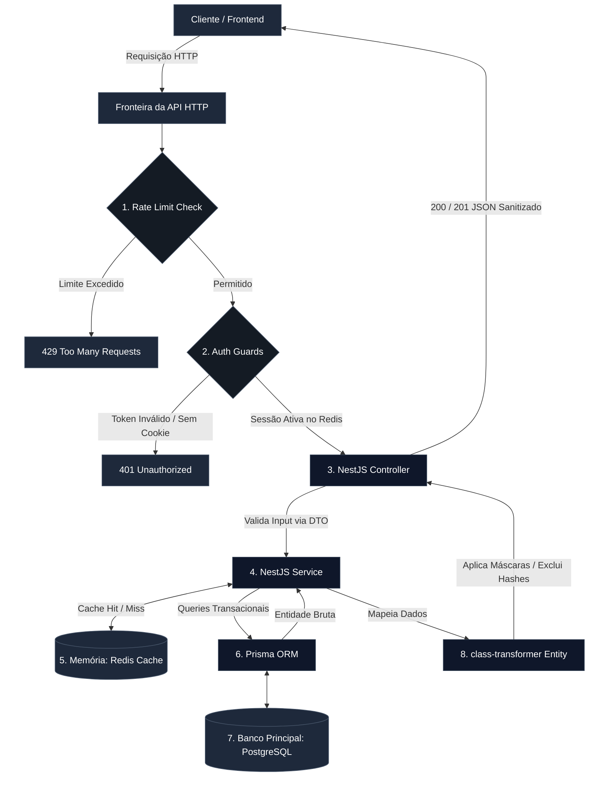

# AutoBots API - Sistema de Gestão de Oficina Mecânica

# Visão Geral da Arquitetura e Decisões de Engenharia

Este documento fornece uma visão holística do ecossistema da aplicação, detalhando a escolha da stack tecnológica, os padrões arquiteturais adotados, o fluxo global de dados e as estratégias implementadas para garantir alta performance, segurança (LGPD) e manutenibilidade.

O ecossistema backend do Auto-Bots foi desenvolvido sob a arquitetura modular do **NestJS**, seguindo os princípios do SOLID e o padrão de injeção de dependências. A aplicação adota uma divisão clara de responsabilidades em camadas independentes, o que facilita a testabilidade, o desacoplamento e a manutenção do código.

---

## 1. Stack Tecnológica e Justificativas de Negócio

Cada componente da nossa infraestrutura foi selecionado para resolver problemas específicos de resiliência, tipagem estrita e escalabilidade:

| Tecnologia           | Papel na Infraestrutura     | Justificativa Técnica / Engenharia                                                                                                                               |
| :------------------- | :-------------------------- | :--------------------------------------------------------------------------------------------------------------------------------------------------------------- |
| **Node.js + NestJS** | Framework Backend Principal | Fornece uma arquitetura opinativa baseada em TypeScript (Inversão de Controle e Injeção de Dependências), facilitando a criação de módulos isolados e testáveis. |
| **TypeScript**       | Linguagem de Programação    | Tipagem estrita em tempo de compilação, reduzindo bugs em runtime e servindo como auto-documentação do modelo de domínio.                                        |
| **Prisma ORM**       | Camada de Persistência SQL  | Mapeamento objeto-relacional com _type-safety_ nativo. Facilita transações ACID complexas e migrações controladas por versão.                                    |
| **PostgreSQL**       | Banco de Dados Relacional   | Escolhido pela robustez na consistência de dados, suporte avançado a restrições de chaves (`Constraints`), ACID estrito e performance com índices.               |
| **Redis**            | Cache e Gestão de Sessão    | Banco em memória utilizado em duas frentes críticas: cache de leitura reativo (_Cache-Aside_) e armazenamento de hashes para rotação de tokens.                  |

### Por que NestJS?

É comum encontrar sistemas de gestão corporativa (ERP/CRM) desenvolvidos em ecossistemas tradicionais como Java (Spring Boot), C# (.NET) ou Python. No entanto, a escolha do **NestJS (Node.js/TypeScript)** para este projeto foi guiada por uma análise técnica da natureza do negócio de uma oficina mecânica:

1. **Predominância de Operações I/O-Bound:** O núcleo (_core_) de um sistema de oficina envolve gerenciamento de inventário, fluxo de pátio, cadastros e ordens de serviço. Essas operações são essencialmente focadas em entrada e saída de dados (I/O) — consultas ao banco de dados, escrita de logs, cache em memória e comunicação HTTP.

2. **Desempenho Assíncrono com Event Loop:** O Node.js brilha exatamente em cenários I/O-bound devido à sua arquitetura _single-threaded_ baseada em um _Event Loop_ não-bloqueante. Ele consegue lidar com milhares de requisições simultâneas de forma extremamente leve, sem o overhead de gerenciamento de múltiplas threads que linguagens como Java ou C# exigiriam para o mesmo volume de acessos simples.

3. **Ausência de Cenários CPU-Bound:** O sistema não realiza processamentos matemáticos pesados, renderização de vídeo, inteligência artificial local ou manipulação intensa de dados em memória que demandem processamento multi-threading ou alto uso de CPU (cenários onde Java ou C# teriam vantagem clara).

4. **Produtividade e Robustez (TypeScript + Arquitetura Angular-like):** O NestJS resolve o maior problema histórico do Node.js em sistemas corporativos: a falta de padrão. Ao impor uma arquitetura fortemente inspirada em conceitos de Engenharia de Software modernos (Injeção de Dependências, Módulos, Controllers e Services), o framework garante que o código TypeScript permaneça escalável, tipado e fácil de manter a longo prazo, aproximando a experiência de desenvolvimento à solidez do Spring ou .NET, mas com a agilidade do ecossistema JavaScript.

### Ambientes e Documentação

- **🚀 API em Produção (Deploy):** [https://auto-bots-api-production-e878.up.railway.app](https://auto-bots-api-production-e878.up.railway.app)
- **📖 Documentação Swagger (Ambiente Local):** `http://localhost:3000/api/`
- **📬 Documentação Swagger (Produção):** [https://auto-bots-api-production-e878.up.railway.app/api](https://auto-bots-api-production-e878.up.railway.app/api)

---

## 2. Estilo Arquitetural e Fluxo de Dados Global

A aplicação segue os princípios da **Arquitetura Modular**, onde cada domínio de negócio (User, Customer, Product, Vehicle, Stock) possui sua própria pasta contendo Controllers, Services, DTOs e Entities de forma isolada. Isso prepara o ecossistema para uma eventual transição para microsserviços se houver necessidade de escala.

O diagrama abaixo ilustra o ciclo de vida completo de uma requisição trafegando pelas camadas do sistema:



### Matriz de Políticas e Ciclo de Vida por Módulo

Para além da documentação tradicional de rotas, a tabela abaixo consolida como as políticas de segurança, infraestrutura e persistência de dados cross-play são orquestradas de forma centralizada em cada barramento da API:

| Prefixo do Módulo | Autenticação / Guards                                   | Camada de Cache (Redis)                                                                                     | Persistência (Postgres)                                                  | Comportamento Crítico / Segurança                                                                      |
| :---------------- | :------------------------------------------------------ | :---------------------------------------------------------------------------------------------------------- | :----------------------------------------------------------------------- | :----------------------------------------------------------------------------------------------------- |
| **`/auth`**       | `ThrottlerGuard` (Rate Limit) e `RefreshTokenGuard`     | **Sessões (Escrita/Leitura):** Salva e rotaciona hashes de tokens.                                          | Não se aplica diretamente.                                               | Injeta cookies `HTTPOnly`, `Secure` e `Signed`. Limpa o Redis no logout.                               |
| **`/users`**      | `AccessTokenGuard` (Exceto na rota pública `/register`) | **Cache-Aside (Leitura):** `GET /:id` cacheia o perfil. **Invalidação:** `PATCH` e `DELETE` limpam a chave. | Tabela `users` e `addresses`. Criação e exclusão em cascata (`Cascade`). | Senha com Argon2. CPF com HMAC (hash cego) e AES-256-GCM.                                              |
| **`/customers`**  | `AccessTokenGuard` + `ThrottlerGuard`                   | Não implementado (Módulo de baixa concorrência).                                                            | Tabela `customers`.                                                      | **LGPD Reativo:** `DELETE` executa descaracterização/anonimização dos dados PII.                       |
| **`/products`**   | `AccessTokenGuard`                                      | Não implementado.                                                                                           | Tabela `products` e `stocks`.                                            | **Soft Delete Bypass:** `POST` com SKU inativo reativa o registro via `Prisma.$transaction`.           |
| **`/stock`**      | `AccessTokenGuard` + `ThrottlerGuard`                   | Não implementado.                                                                                           | Tabela `stocks` e `stock_movements`.                                     | **Garantia de Atomicidade:** Validações em memória e escrita atômica via `Prisma.$transaction` (ACID). |
| **`/vehicles`**   | `AccessTokenGuard`                                      | Não implementado.                                                                                           | Tabela `vehicles`.                                                       | **Integridade de Pátio:** Validação de placa (Mercosul) e barreira de FK obrigatória de cliente.       |

---

## 3. Governança de Dados, Criptografia e LGPD

Por lidar com Informações de Identificação Pessoal (PII) — como nomes, CPFs e telefones de clientes e colaboradores —, a arquitetura implementa três conceitos fundamentais de segurança em nível de aplicação:

**1. Separação de Responsabilidades de Busca e Armazenamento (Blindagem PII)**

Para o dado sensível do CPF, o banco de dados nunca armazena o valor em texto puro. Em vez disso, dividimos o campo em duas estratégias complementares:

- `cpf_hash` **(Busca Determinística):** Gerado via HMAC-SHA256. Permite que o sistema execute buscas exatas (findUnique) de forma indexada e rápida sem expor o documento original.
- `cpf_encrypted` **(Armazenamento Seguro):** Criptografado de forma simétrica com o algoritmo AES-256-GCM (armazenando o vetor de inicialização `iv` e a `tag` de autenticação). O dado fica ilegível em repouso no PostgreSQL.

**2. Ciclo de Vida de Saída Automatizado**

Nenhuma rota expõe os hashes ou chaves brutas de criptografia. A camada de entidades do `class-transformer` intercepta o retorno do banco de dados e executa duas tarefas antes do envio do JSON:

- `@Exclude()`: Remove propriedades críticas como password_hash, cpf_hash e chaves de sessão.
- `Getters Dinâmicos`: Descriptografa o `cpf_encrypted` em memória e aplica máscaras de apresentação para o usuário (ex: `***.456.***-00` ou aplicação de máscaras de telefone), garantindo conformidade visual com as boas práticas de privacidade.

**3. Anonimização Reativa (Direito ao Esquecimento)**

Ao excluir um cliente do sistema, a aplicação não realiza o expurgo físico destrutivo imediato para preservar a integridade histórica de ordens de serviço financeiras. Em vez disso, executa-se um processo de **Descaracterização de Dados**:

- Campos de texto viram placeholders genéricos (`Cliente Anonimizado`).
- Emails e CPFs recebem um sufixo único aleatório baseado em hash (`anon-df84b2...`), liberando as constraints de unicidade `(@unique)` do banco de dados para que o cliente real possa se recadastrar no futuro, se desejar, enquanto o registro antigo fica 100% anonimizado.

---

## 4. Estratégia de Disponibilidade (Rate Limit e Cache)

Para blindar a infraestrutura contra picos de tráfego acidentais ou ataques coordenados de negação de serviço (DoS), o sistema adota:

- **Rate Limiting Distribuído:** Restrição de requisições por janela de tempo através do `ThrottlerGuard` injetado estrategicamente em rotas públicas (como `/auth/login` e `/users/register`).
- **Cache-Aside Pattern:** Leituras de alta frequência (como perfis de usuários e catálogos de produtos estáveis) são servidas pelo **Redis**. A invalidação ocorre de forma cirúrgica `(clearCache)` apenas durante eventos mutáveis de escrita (`PATCH`, `DELETE`), mantendo a consistência eventual sem causar stale data.

---

## 5. Camadas Principais

Cada módulo funcional da aplicação (ex: `User`, `Auth`, `Customer`) é estruturado internamente em três camadas principais:

### 1. Camada de Apresentação (Controllers & Gateways)

É a porta de entrada da aplicação, responsável por expor a API RESTful e gerenciar o protocolo HTTP.

- **Validação de Entrada:** Utiliza `ValidationPipe` junto com as bibliotecas `class-validator` e `class-mapper` para garantir que os dados recebidos (DTOs) estejam estritamente no formato esperado antes de tocar a lógica de negócio.
- **Segurança e Guardas:** É nesta camada que os `Guards` globais e específicos atuam. O `AccessToken Guard` intercepta as requisições para validar a autenticidade do JWT e se comunicar com o Redis para checar o status da sessão.

### 2. Camada de Lógica de Negócio (Services & Use Cases)

O coração da aplicação. Esta camada é completamente agnóstica em relação a rotas HTTP ou protocolos de transporte.

- **Regras de Negócio:** Centraliza as validações de fluxo, permissões corporativas e gerenciamento de estados.
- **Orquestração de Segurança:** Intermedeia a chamada para os módulos de criptografia antes de enviar os dados para persistência, garantindo que informações sensíveis sejam tratadas de forma isolada.
- **Integração de Cache:** Interage diretamente com o `CacheService` para gerenciar a leitura e escrita estratégica no Redis.

### 3. Camada de Acesso a Dados (Prisma Repositories & Entities)

Camada responsável pela comunicação com o banco de dados relacional e pela representação das tabelas em objetos de código.

- **Prisma ORM:** Abstrai as queries SQL de forma tipada e segura (Type-safe), garantindo integridade nas transações com o PostgreSQL.
- **Entidades e Sanitização:** Utiliza os decorators do `class-transformer` para aplicar lógica de infraestrutura diretamente nas entidades. É aqui que acontece o mascaramento automático de dados na saída da API (ex: ocultar caracteres de documentos) e a conversão de tipos.

---

## 6. Camadas Transversais e Complementares

Para dar suporte às camadas principais sem gerar acoplamento ou duplicação de código, a aplicação utiliza estruturas globais de compartilhamento:

- **Pasta `common/` (Infraestrutura Compartilhada):** Funciona como o núcleo de configuração global da aplicação. Abriga as inicializações de módulos de infraestrutura que servem a múltiplos domínios, como as diretrizes do módulo do Redis, políticas globais de Caching assíncrono e interceptores de comportamento do framework.
- **Pasta `utils/` (Utilitários Globais e Helpers):** Camada puramente funcional e isolada, responsável por abrigar funções utilitárias puras e agnósticas a regras de negócio. É aqui que residem os motores matemáticos e criptográficos do sistema, como os algoritmos de criptografia (AES-256-GCM), geradores de hash (SHA-256) e as funções de mascaramento estrito de caracteres para dados sensíveis.

> 💡 **Nota sobre Módulos de Domínio:** Módulos como `auth`, `users` e `sessions` (responsável pelo ciclo de vida e rotação de tokens das sessões de usuário) são tratados como módulos de domínio principais da aplicação, consumindo as ferramentas das pastas `common` e `utils` para garantir sua execução segura.

---

## 7. Como Executar o Projeto

Siga o passo a passo abaixo para rodar a aplicação localmente em seu ambiente de desenvolvimento.

### Pré-requisitos

Antes de começar, você precisará ter instalado em sua máquina:

- [Node.js](https://nodejs.org/) (v18 ou superior)
- [Docker](https://www.docker.com/) e Docker Compose

### Passos para Execução

1. **Clonar o Repositório e Instalar Dependências:**

```bash
   git clone [https://github.com/leonardooliveira00/auto-bots-api.git](https://github.com/leonardooliveira00/auto-bots-api.git)
   cd auto-bots
   npm install
```

2. **Configurar Variáveis de Ambiente:**

Crie um arquivo .env na raiz do projeto baseado no .env.example e preencha as credenciais (Portas, chaves de criptografia AES-256, secrets do JWT e strings de conexão):

```bash
cp .env.example .env
```

---

3. **Subir a Infraestrutura (PostgreSQL & Redis):**

Utilize o Docker Compose para isolar e rodar os serviços de banco de dados e cache em segundo plano:

```bash
docker compose up -d
```

---

4. **Rodar as Migrations do Banco de Dados:**

Com o banco de dados online, execute as migrações do Prisma para estruturar as tabelas e gerar o Prisma Client tipado:

```bash
npx prisma generate
npx prisma migrate dev
```

---

5. **Iniciar o Servidor de Desenvolvimento:**

Agora, inicialize o servidor de desenvolvimento do NestJS. A API estará pronta para receber requisições:

```bash
npm run start:dev
```

A aplicação estará disponível por padrão em `http://localhost:3000`.

---

## 💡 Observações

Este projeto foi desenvolvido com foco em aprendizado avançado de backend, aplicando conceitos reais utilizados em ambientes de produção, principalmente no tratamento de dados sensíveis.
