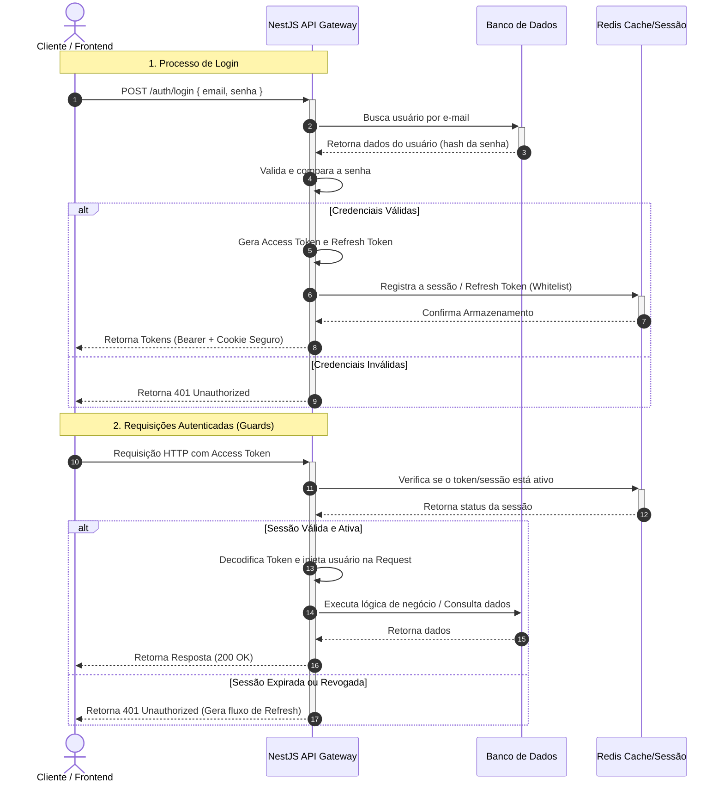
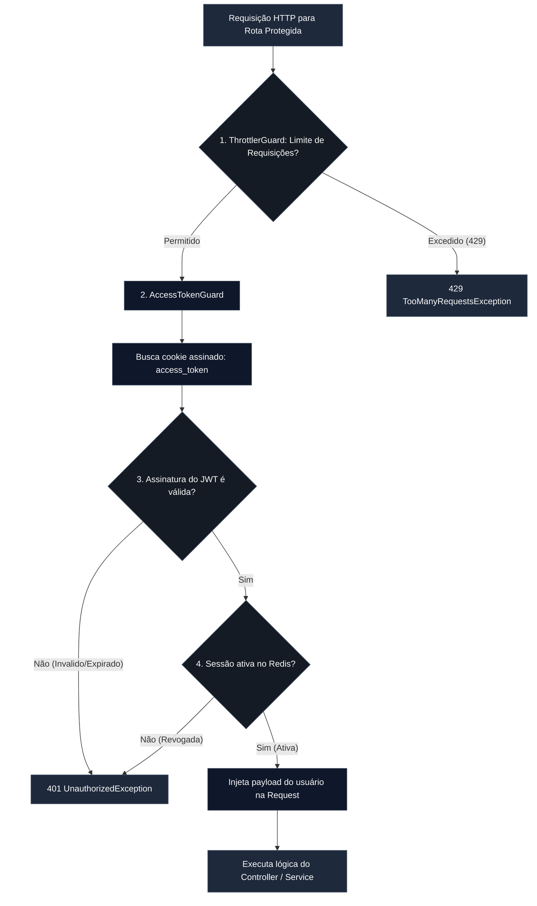
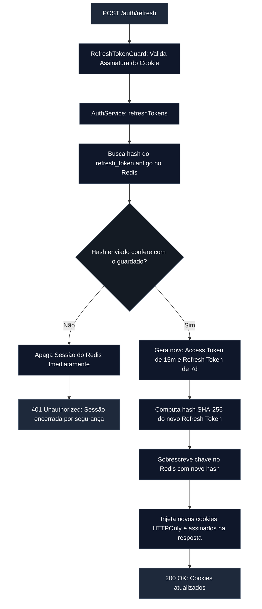

# Módulo de Autenticação e Gestão de Sessões

O módulo de autenticação é o pilar de segurança perimetral do sistema. Ele é responsável pelo controle de acessos através de tokens JWT assíncronos e simétricos, validação de segurança via criptografia reativa no Argon2, prevenção de abusos de infraestrutura via Rate Limiting e gerenciamento de sessões com ciclo de rotação de chaves (_Refresh Token Rotation_) persistidas em Redis.

## Diagrama de Sequência

Abaixo está detalhado o ciclo de vida desde o login por e-mail e senha até a validação das requisições subsequentes:

---

## Arquitetura de Proteção de Rotas e Guards

Para garantir que operações restritas fiquem inacessíveis a usuários maliciosos, a aplicação implementa uma composição de interceptadores globais encapsulados sob o decorator `UseAuth()`.

---

## Fluxo de Renovação Segura de Sessão (Refresh Token Rotation)

A rotação de tokens mitiga o roubo de credenciais persistentes. Quando o cliente solicita um novo token de acesso através da rota `/auth/refresh`, o sistema valida o hash armazenado e invalida o par anterior.

---

## Especificações Técnicas e Diretrizes de Segurança

**1. Cookies HTTPOnly Assinados (`signedCookies`)**

Em vez de trafegar os tokens JWT no corpo das respostas JSON (facilitando vazamentos via ataques de Cross-Site Scripting - XSS), a API encapsula os payloads dentro de cookies nativos do protocolo HTTP com as diretivas:

- `httpOnly: true`: Impede o acesso ou leitura dos tokens através de scripts executados no navegador (document.cookie).
- `secure: true`: Força o tráfego exclusivo dos cookies por conexões criptografadas HTTPS.
- `sameSite: 'strict'`: Blindagem nativa contra ataques de falsificação de requisições entre sites (Cross-Site Request Forgery - CSRF).
- `signed: true`: O cookie é assinado com a chave secreta da aplicação na borda do Express, invalidando de forma automática cookies adulterados no lado do cliente antes de chegarem aos Guards.

**2. Configurações de Ciclo de Vida (TTL)**

- **Access Token:** Tempo de expiração curto (15 minutos), reduzindo a janela de vulnerabilidade caso um token temporário seja interceptado.
- **Refresh Token:** Tempo de vida longo (7 dias), limitado estritamente ao escopo da rota de renovação (path: '/auth/refresh').

**3. Mecanismo de Logout Concorrente**

A invalidação do acesso é síncrona e definitiva. O endpoint `POST /auth/logout` remove imediatamente a chave identificadora do usuário de dentro da memória do Redis, invalidando de forma reativa qualquer Access Token que ainda esteja dentro do período de validade de 15 minutos, e limpa os cookies HTTPOnly do navegador do cliente através de comandos `clearCookie`.

**4. Armazenamento no Redis**

- **Estratégia:** Em vez de apenas decodificar o token de forma stateless, o sistema consulta o Redis no Guard de autenticação para validar se aquela sessão ainda é legítima.
- **Segurança vs Performance:** A validação é feita diretamente na memória (Redis), o que mantém o tempo de resposta extremamente baixo e adiciona uma camada robusta de proteção, permitindo derrubar sessões instantaneamente se necessário.

**5. Proteção de Dados**

- Credenciais trafegam estritamente via HTTPS.
- O hash da senha no banco utiliza algoritmos seguros.
