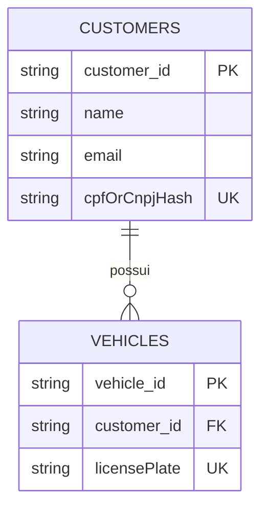
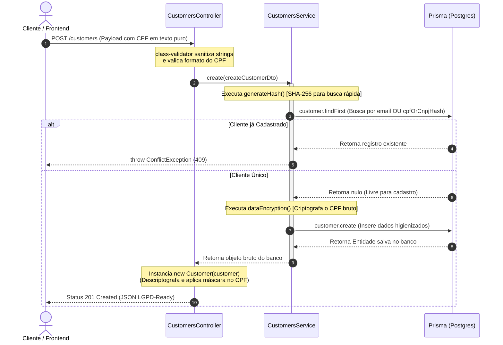
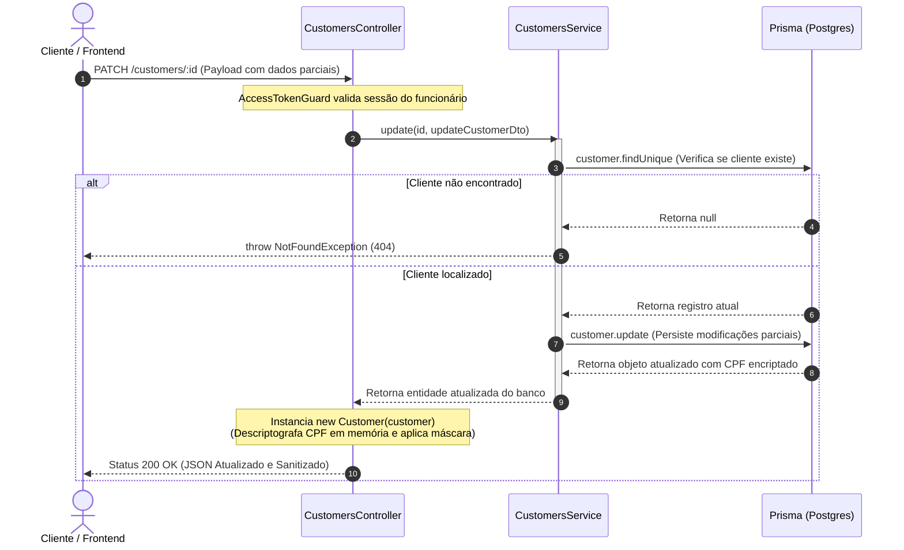
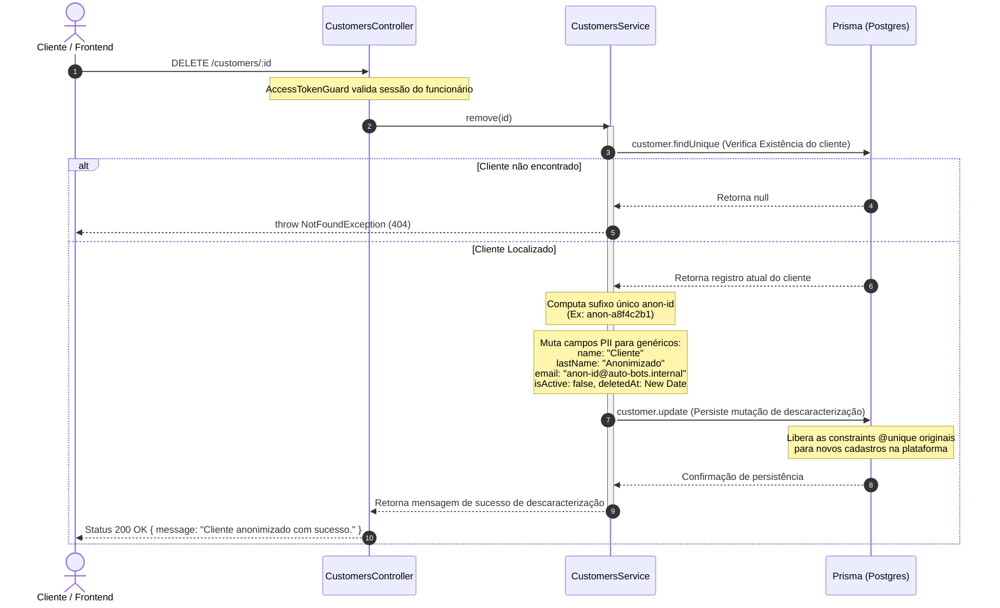
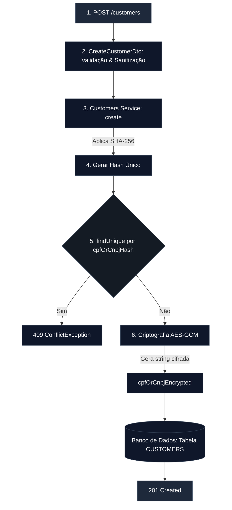
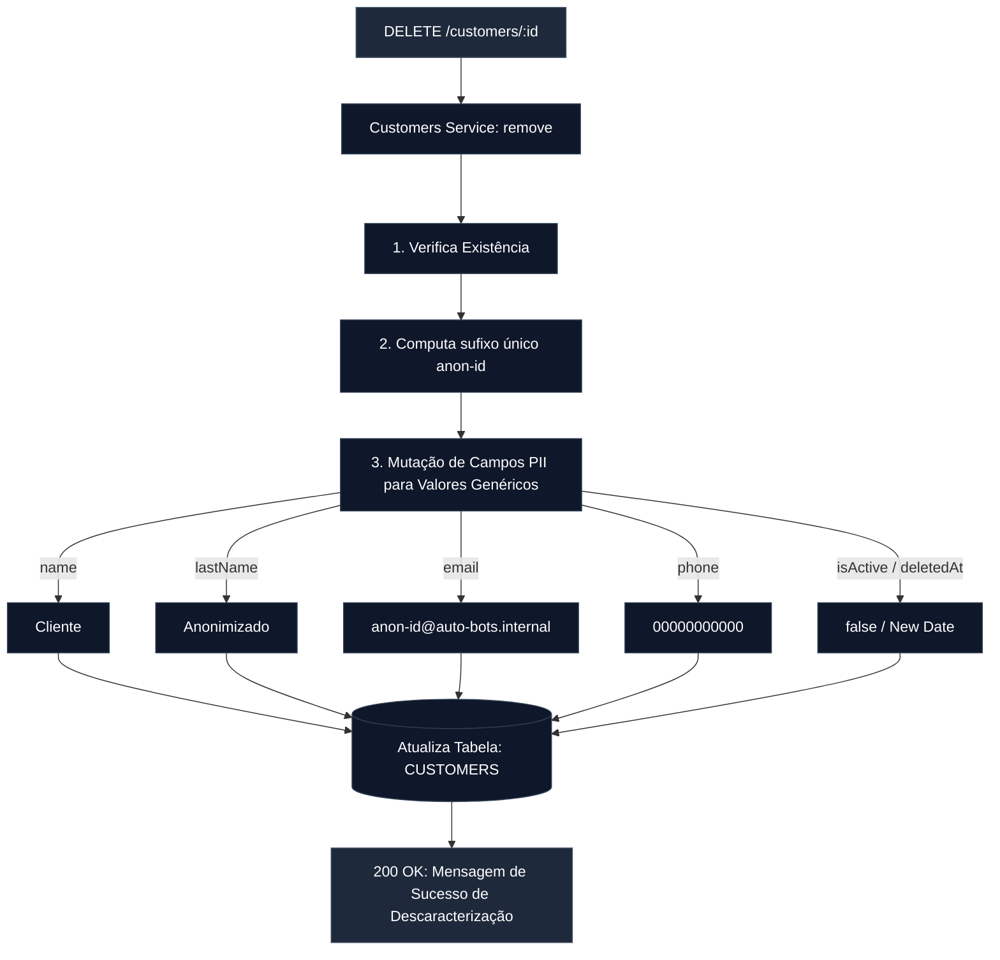

# Módulo de Clientes e Proteção de Dados (LGPD)

O módulo de clientes gerencia os dados cadastrais dos proprietários dos veículos atendidos. Devido à natureza sensível das informações tratadas (como CPF, CNPJ, e-mail e telefone), o módulo foi projetado sob os pilares de **Privacy by Design**, implementando criptografia em repouso e rotinas rígidas de anonimização em conformidade com as diretrizes da LGPD.

## Modelo de Relacionamento Local (Contexto ER)

---

## Diagramas de Sequência do Módulo de Clientes

Para entender a linha do tempo, a troca de mensagens entre as camadas e os gatilhos de segurança/criptografia aplicados aos dados PII dos clientes, os fluxos abaixo detalham os cenários de **Criação com Blindagem de Dados** e de **Deleção por Anonimização (Soft Delete)**.

### 1. Fluxo de Criação de Cliente (`POST /customers`)

Este diagrama ilustra o pipeline de validação de duplicidade performática usando o hash cego (SHA-256) e a persistência do dado encriptado (AES-GCM).

### 2. Fluxo de Atualização Cadastral (`PATCH /customers/:id`)

Este diagrama demonstra a alteração parcial de metadados do cliente e o comportamento de reidratação da camada de saída para garantir a entrega dos dados pessoais mascarados.

### 3. Fluxo de Remoção por Ofuscação e Descaracterização (`DELETE /customers/:id`)

Este fluxo detalha a rotina de anonimização (Soft Delete reativo), onde os dados sensíveis são substituídos por placeholders genéricos e as chaves únicas recebem o sufixo aleatório para liberar o reaproveitamento do CPF e e-mail no sistema.

---

## Arquitetura de Persistência de Dados Sensíveis

Para garantir a máxima segurança dos dados de identificação pessoal (PII) sem comprometer a performance de indexação do banco de dados, o sistema adota uma abordagem híbrida de criptografia e hashing:

---

## Ciclo de Vida e Mascaramento de Saída (Serialization)

Garantindo que dados brutos nunca transitem desnecessariamente, a camada de serialização (`class-transformer`) intercepta a resposta da API na saída do Controller, realizando a descriptografia e a formatação visual (máscaras) em tempo de execução.

- `cpfOrCnpjHash`: Marcado estritamente com @Exclude(), impedindo que o hash de busca vaze em qualquer payload público.
- `cpfOrCnpjEncrypted`: Descriptografado dinamicamente e injetado na propriedade tratada com a máscara padrão brasileira (`000.000.000-00` / `00.000.000/0000-00`).
- `phone`: Sanitizado com regex numérico na entrada de dados e retornado com formatação telefônica nativa (`(DDD) 99999-9999`).

---

## Processo de Exclusão Segura e Pseudonimização (Soft Delete + LGPD)

Quando um cliente solicita a remoção de sua conta ou o vínculo comercial é desfeito, o sistema executa o método `remove()`. Para não quebrar o histórico financeiro ou a integridade de ordens de serviço e veículos órfãos no banco de dados, o registro não é apagado fisicamente, mas passa por um processo irreversível de descaracterização de dados.

---

## Especificações Técnicas dos Endpoints

**1. Modelagem de Dados (Prisma Schema)**
A tabela `customers` foi projetada para isolar metadados de auditoria e indexes de segurança, mantendo o relacionamento de um para muitos (`1:N`) com a entidade de veículos:

- **`cpfOrCnpjHash`**: Indexado como `@unique` para validação de duplicidade em tempo de inserção de forma performática.
- **`cpfOrCnpjEncrypted`**: Armazena o dado criptografado em repouso sem indexação para proteção contra SQL Injection e vazamentos físicos.
- **`deletedAt`**: Campo opcional (`DateTime?`) mapeado para suportar a retenção histórica exigida pelo ciclo de vida de auditoria pós-anonimização.

**2. Validação de Payload com `class-validator`**

- **Tratamento de Strings de E-mail:** O DTO força o uso do decorator `@Transform` para aplicar `.toLowerCase().trim()` no campo, evitando que e-mails duplicados em caixas altas burlem validações ou criem dados poluídos.
- **Flexibilidade de Documento::** A validação aceita dinamicamente strings numéricas puras de 11 dígitos (CPF) ou 14 dígitos (CNPJ) por meio de expressões regulares combinadas `(Matches)`.

**3. Parâmetros de Filtros Situacionais**

A rota `GET /customers` implementa o gerenciamento reativo do status cadastral via Query Parameters, permitindo que as requisições segmentem a consulta entre:

- `active`: Traz apenas os clientes operantes na oficina (Comportamento Padrão).
- `inactive`: Retorna os clientes desativados e pseudonimizados.
- `all`: Desativa o filtro reativo no Prisma (`undefined`) e varre a base de dados completa para auditoria técnica.
