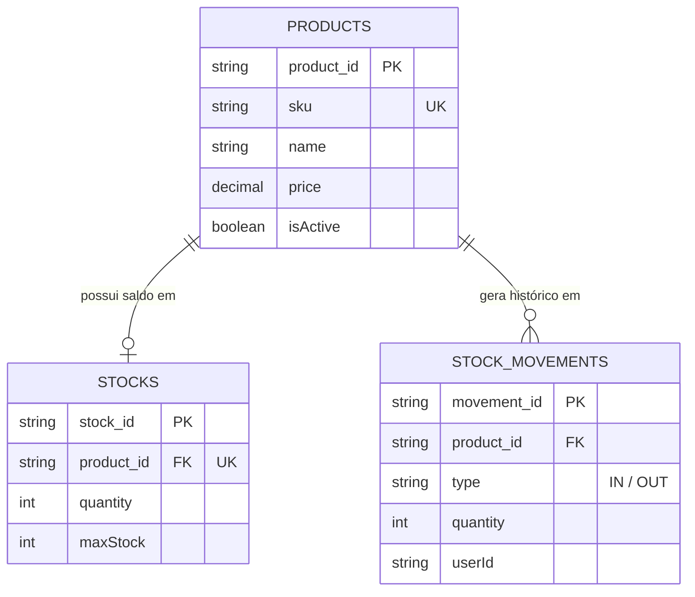
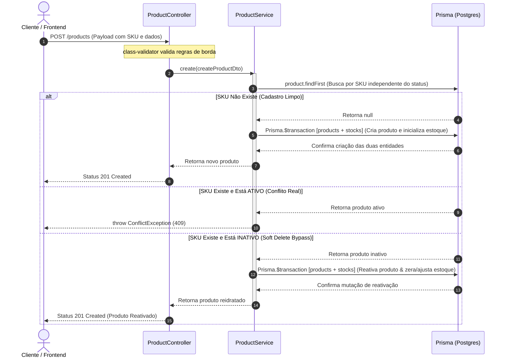
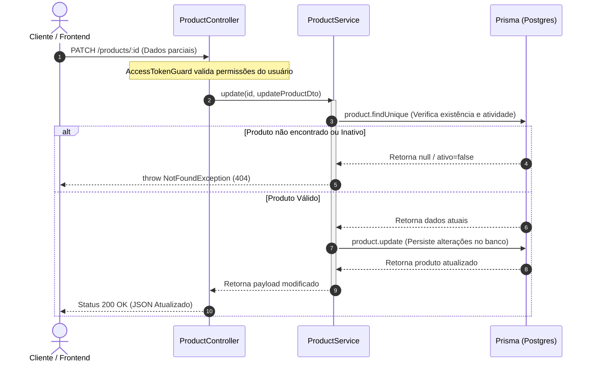
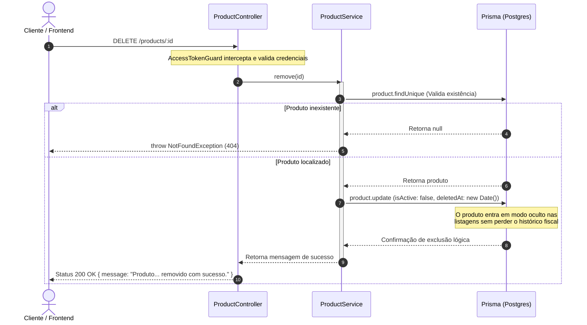
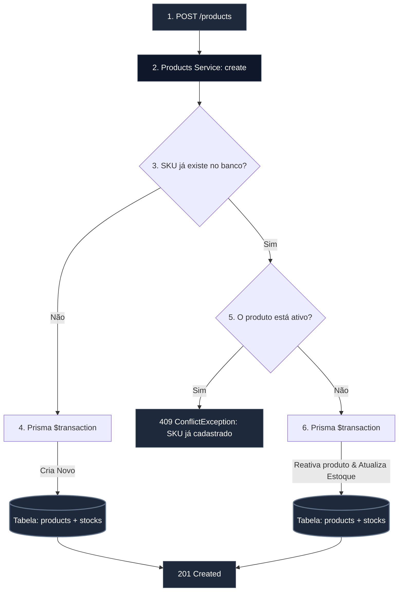
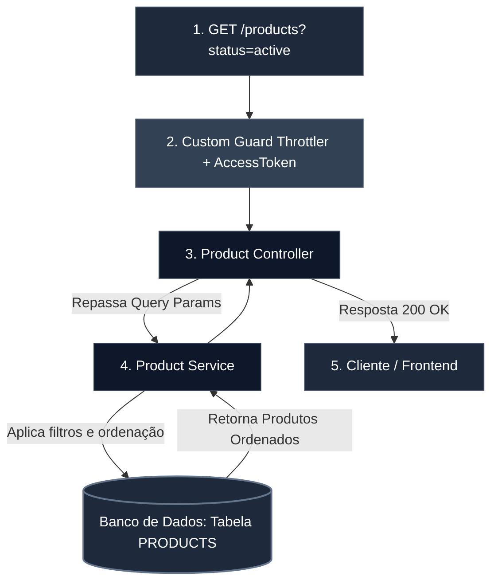

# Módulo de Produtos

O módulo de produtos é responsável pelo ciclo de vida dos itens catalogados na aplicação. O serviço foi arquitetado com foco em resiliência, adotando estratégias de **Soft Delete**, reativação automática e validações de integridade de estoque no momento do cadastro.

## Modelo de Relacionamento Local (Contexto ER)

A tabela `products` centraliza o catálogo de itens comercializáveis ou utilizados como insumos na oficina. Ela atua como a entidade pai para o controle quantitativo de pátio:

- **`sku` (Stock Keeping Unit)**: Indexado como `@unique` para servir como o identificador comercial universal do produto, alimentando a lógica de reativação automática.
- **`price`**: Mapeado como `@db.Decimal(10, 2)` para garantir precisão cirúrgica centesimal em operações aritméticas de venda e avaliação de inventário.
- **`stock` / `movements`**: Estabelece integridade referencial estrita para isolar o saldo atualizado (`Stock`) do livro de registros históricos de movimentações (`StockMovement[]`).

---

## Diagramas de Sequência do Módulo de Produtos

Para visualizar a coordenação de mensagens entre o Controller, o Service e o Banco de Dados, os fluxos abaixo detalham a inteligência por trás da **Criação com Reativação Automática de SKU** e as operações de escrita do ciclo de vida dos produtos.

### 1. Fluxo de Criação e Reativação de SKU (`POST /products`)

Este diagrama ilustra o comportamento reativo do sistema ao interceptar cadastros. Ele demonstra o desvio lógico que reativa um produto arquivado via transação síncrona em vez de estourar uma exceção de duplicidade.

### 2. Fluxo de Atualização Parcial (`PATCH /products/:id`)

Este fluxo demonstra a modificação reativa de metadados do produto (como preço ou descrição) mantendo a consistência isolada, sem afetar as tabelas de movimentação de pátio de forma direta.

### 3. Fluxo de Arquivamento / Soft Delete (`DELETE /products/:id`)

Este diagrama detalha a exclusão lógica do produto, alterando a flag de atividade e registrando a marca de auditoria cronológica.

---

## Fluxo de Criação e Reativação Automática (SKU)

Para evitar duplicidade de registros únicos e preservar o histórico do banco de dados, o processo de criação adota uma estratégia inteligente de verificação de estado baseado no **SKU**:

---

## Detalhes da Implementação Técnica

**1. Estratégia de Soft Delete (Remoção Segura)**

A remoção de produtos `(DELETE /products/:id)` não executa um `DELETE` físico na base de dados. Em vez disso, o método `remove` aplica um `Soft Delete`, alterando o sinalizador `isActive` para `false`.

- **Benefício**: Mantém o histórico de movimentações antigas e integridade referencial com outras tabelas, ocultando o produto das listagens padrões.

**2. Validações de Consistência na Entrada**

A API impede estados inconsistentes de estoque diretamente no DTO e na validação interna do serviço:

- O valor de `minStock` não pode ser superior ao `maxStock`.
- A quantity inicial de cadastro não pode ser menor do que o limite definido em `minStock`.

**3. Ciclo de Vida da Manipulação**

Qualquer operação de escrita `(POST, PUT, DELETE)` ou de leitura `(GET)` passa obrigatoriamente pela validação do `Cookie HTTPOnly` e pela verificação de integridade da sessão no **Redis** através do nosso **Guard Unificado**.

---

## Fluxo de Busca com Filtros e Ordenação

- **Filtros e Listagem Otimizada**

O método `findAll` resolve o filtro de status de maneira nativa, aplicando por padrão a exibição apenas de itens ativos, trazendo os dados ordenados cronologicamente de forma decrescente `(orderBy: { createdAt: 'desc' })`.

Para garantir a melhor performance do banco de dados, as regras de busca foram consolidadas diretamente na camada de serviço da API:

- **Filtro por status (Opcional):** Permite listar de forma segmentada apenas os produtos ativos `(active)` ou inativos `(inactive)`.
- **Ordenação por Padrão (orderBy):** Para garantir que os produtos mais novos ou atualizados recentemente apareçam primeiro na interface do usuário, a API aplica nativamente a ordenação decrescente baseada na data de criação`(createdAt: 'desc')`.

O endpoint de listagem `(GET /products)` intercepta parâmetros da URL para entregar uma resposta refinada direto do banco de dados, poupando memória do servidor.

---

## Próximos Passos (Backlog Técnico)

- **Controle de Acesso Baseado em Roles (RBAC):** Restringir as rotas de mutação (POST, PUT, DELETE) para que apenas usuários com nível de acesso administrativo possam alterar os produtos, mantendo a rota de listagem (GET) acessível para funcionários comuns.
