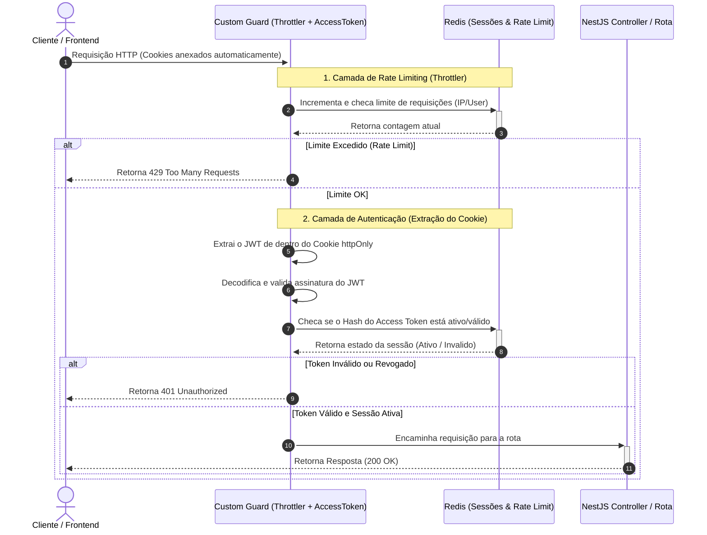
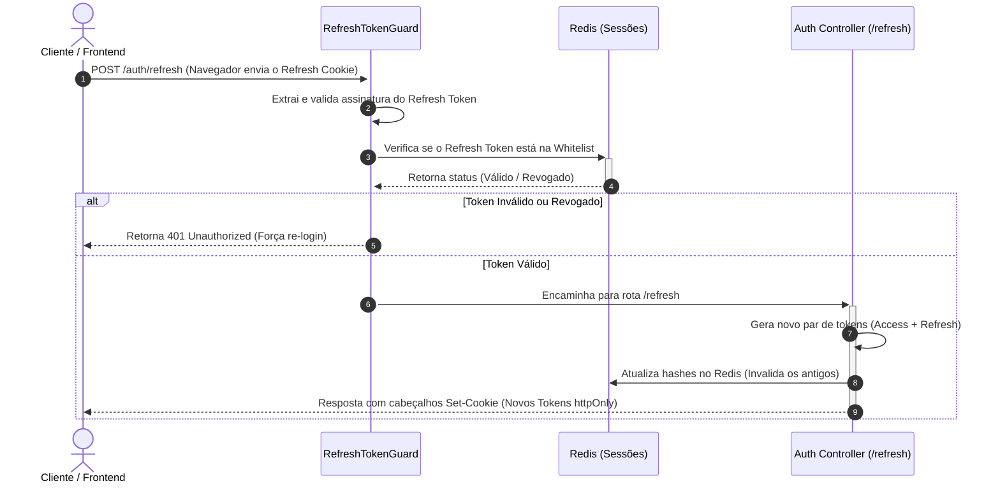

# Módulo de Sessions e Proteção de Rotas

O sistema adota uma estratégia de segurança em camadas para proteger os endpoints da API. Combinamos controle de taxa de requisições (**Rate Limiting / Throttler**), validação de estado do token no **Redis** e armazenamento seguro via **Cookies HTTPOnly**.

## Fluxo de Intercepção de Requisições (Guards & Cookies)

O diagrama abaixo ilustra o ciclo de vida de uma requisição. Repare que o cliente não envia o token manualmente via cabeçalho `Authorization: Bearer`; em vez disso, o navegador anexa o cookie de forma automática e segura a cada requisição.

## Fluxo de Renovação de Sessão (/refresh)

A renovação de tokens também é feita de forma totalmente blindada. O RefreshTokenGuard extrai o token do cookie específico de refresh, e a rota se encarrega de devolver os novos tokens setando os novos cookies no cabeçalho de resposta (Set-Cookie).

## Engenharia e Arquitetura do Módulo

**1.Guard Decorado Unificado**

Em vez de empilhar múltiplos decorators (@UseGuards(ThrottlerGuard, AccessTokenGuard)) em cada rota, o sistema utiliza um Guard customizado que combina ambas as lógicas. Isso garante que:

- O Throttler processe primeiro, poupando processamento de criptografia (extração e decodificação do JWT) caso o cliente esteja fazendo spam de requisições.
- O código das controllers fique mais limpo e padronizado.

---

**2. Validação Stateful com JWT no Redis**

Embora o JWT seja por natureza stateless, armazenar o hash do access_token no Redis transforma a validação em stateful, trazendo o melhor dos dois mundos:

- **Segurança Máxima:** Se um usuário fizer logout ou sua sessão for revogada por um admin, o hash é invalidado instantaneamente no Redis, bloqueando acessos futuros imediatamente (derrubada em tempo real).
- **Performance Elevada:** Como o Redis opera em memória, a busca pelo hash do token leva frações de milissegundos, mantendo a API extremamente veloz.

---

**3. Blindagem com Cookies HTTPOnly (Mitigação de XSS)**

A estratégia de armazenamento de tokens resolve uma das maiores vulnerabilidades da web moderna:

- **Anti-XSS:** Ao configurar os cookies como httpOnly: true, scripts maliciosos rodando no cliente (via pacotes npm corrompidos ou falhas de injeção) ficam fisicamente impossibilitados de ler os tokens através de document.cookie.
- **Automatização Segura:** O navegador gerencia o envio e expiração desses cookies nativamente, reduzindo a complexidade de gerenciamento de estado no frontend.
