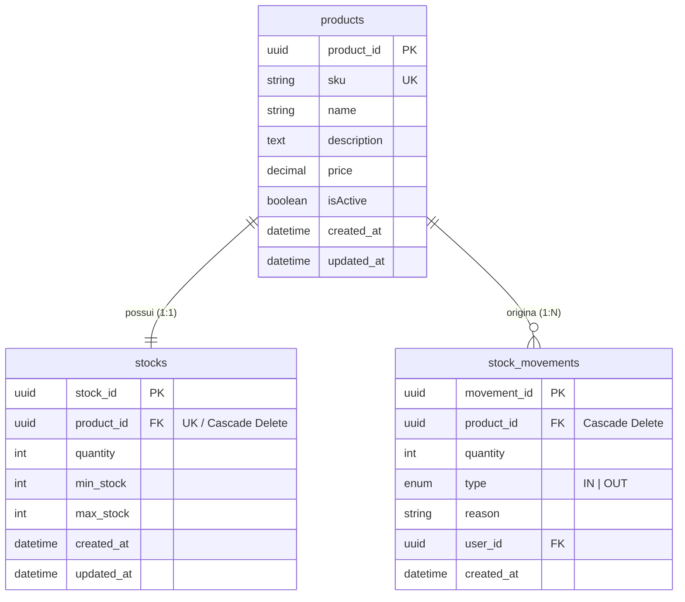
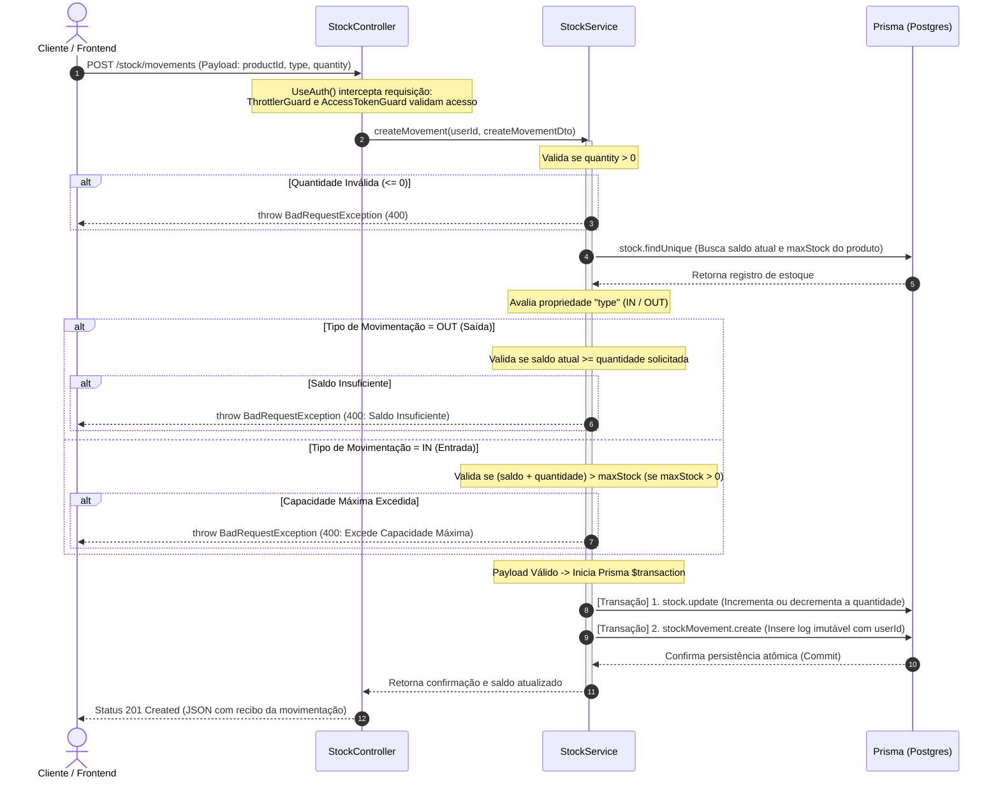
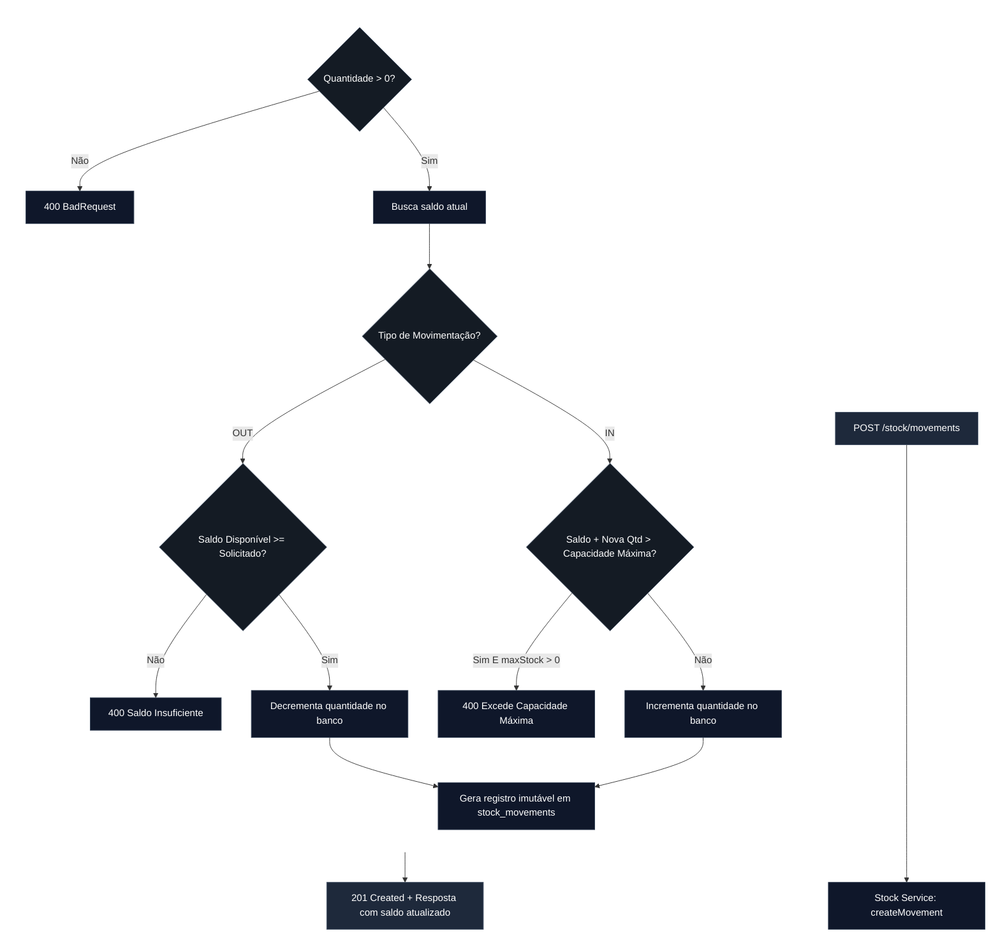
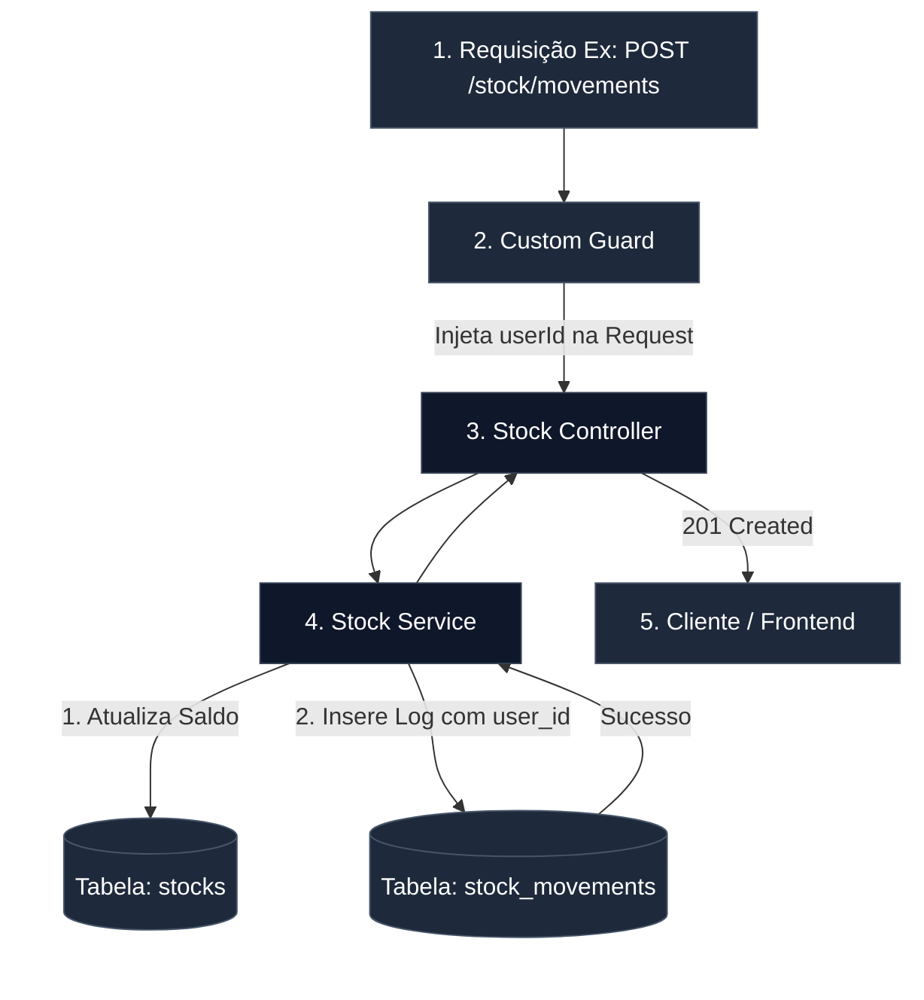

# Módulo de Estoque e Rastreabilidade (Stock)

O controle de estoque é totalmente aninhado e dependente da existência de um produto. Além do saldo atual, o sistema implementa um modelo stateful de **Movimentações de Estoque (Auditoria)**, registrando cada entrada e saída com o respectivo operador responsável.

## Modelo de Dados e Relacionamento (ERD)

Abaixo está o diagrama físico baseado no nosso schema do banco de dados, detalhando a relação `1:1` estrita entre Produto e Estoque, e a relação `1:N` para o histórico de movimentações.

---

## Diagramas de Sequência do Módulo de Estoque

Para entender o comportamento cronológico, a validação de regras de negócio em pátio e a garantia de atomicidade nas operações de inventário, os fluxos abaixo detalham o ciclo de execução da camada de estoque.

### 1. Fluxo de Movimentação de Estoque e Transação ACID (`POST /stock/movements`)

Este diagrama detalha a linha do tempo de uma movimentação, evidenciando as barreiras de validação (capacidade e saldo) e a execução isolada dentro da transação do banco de dados.

---

## Consistência de Operação e Transações ACID

Toda movimentação do estoque dispara um fluxo transacional fechado. Se a atualização do saldo consolidado falhar ou quebrar uma regra de negócio, o log de auditoria é revertido automaticamente pelo banco.

---

## Fluxo de Movimentação de Estoque (Rastreabilidade)

Toda vez que o estoque de um produto sofre uma alteração (IN para entrada ou OUT para saída), o sistema realiza a mutação do saldo atual na tabela stocks e gera um log imutável na tabela stock_movements.

---

## Regras de Integridade e Auditoria

**1. Integridade Referencial em Cascata (onDelete: Cascade):**

As tabelas stocks e stock_movements estão umbilicalmente ligadas à tabela products. Caso um produto seja removido do sistema, o banco de dados executa a deleção em cascata automaticamente para:

- A ficha de estoque correspondente.
- Todo o histórico de movimentações daquele produto específico, evitando registros órfãos.

**2. Regras de Negócio de Armazenamento:**

- min_stock e max_stock: Campos dedicados a apoiar regras de negócio futuras para geração de alertas ou relatórios de compras/reposição automatizada.
- **Rastreabilidade por user_id:** O campo userId (mapeado como user_id no banco) garante a auditoria do sistema, permitindo identificar com precisão qual funcionário realizou a operação de entrada ou saída do estoque.
