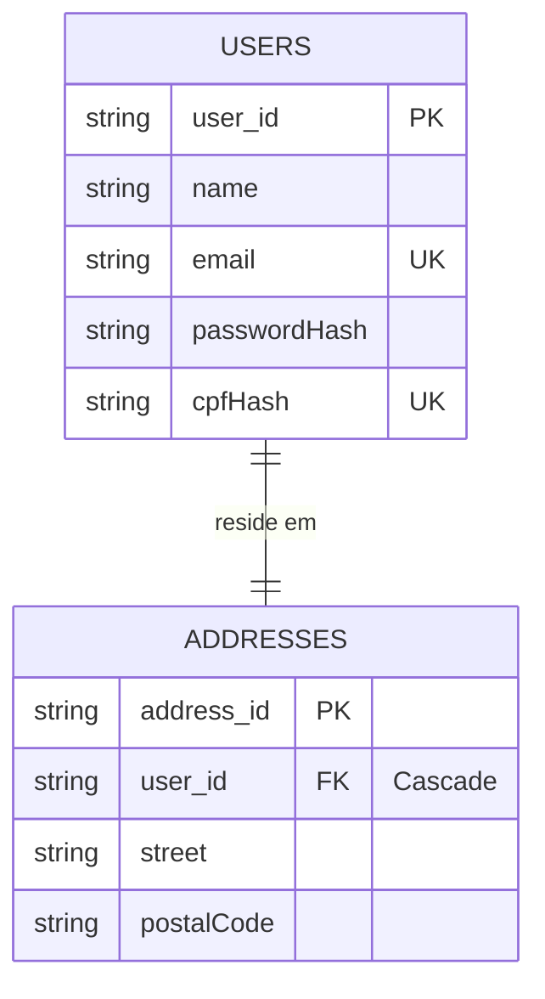
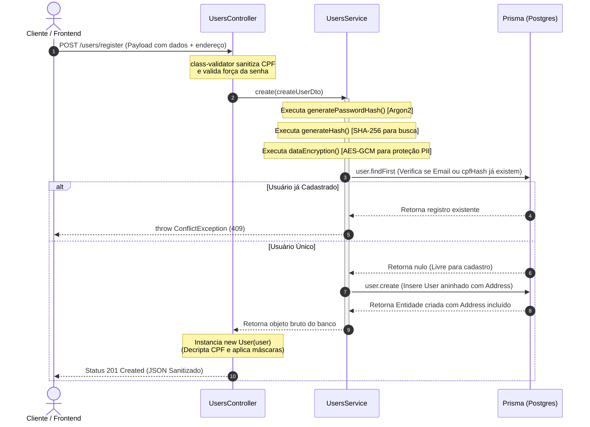
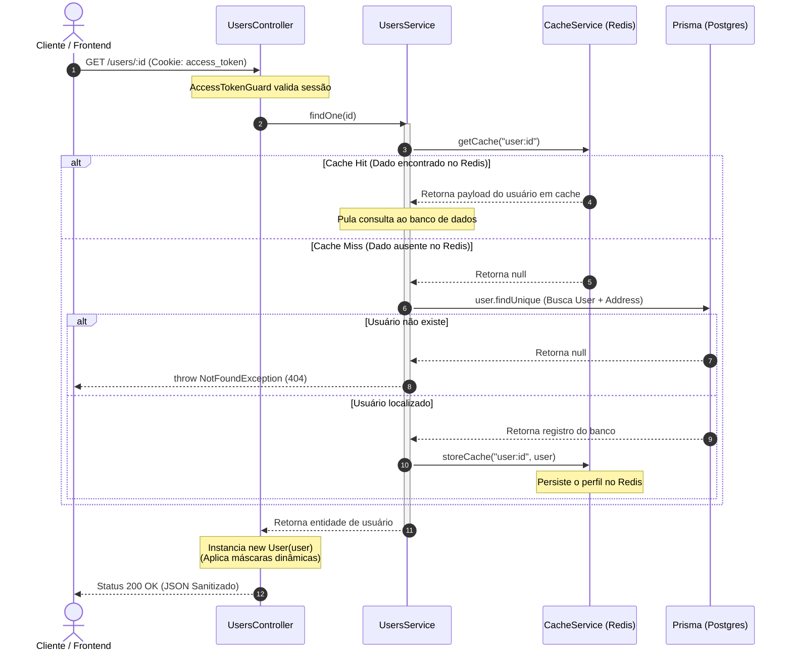
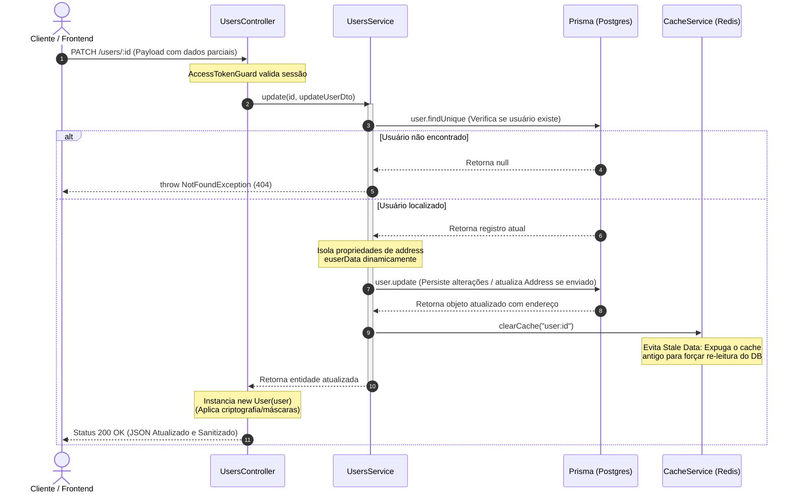
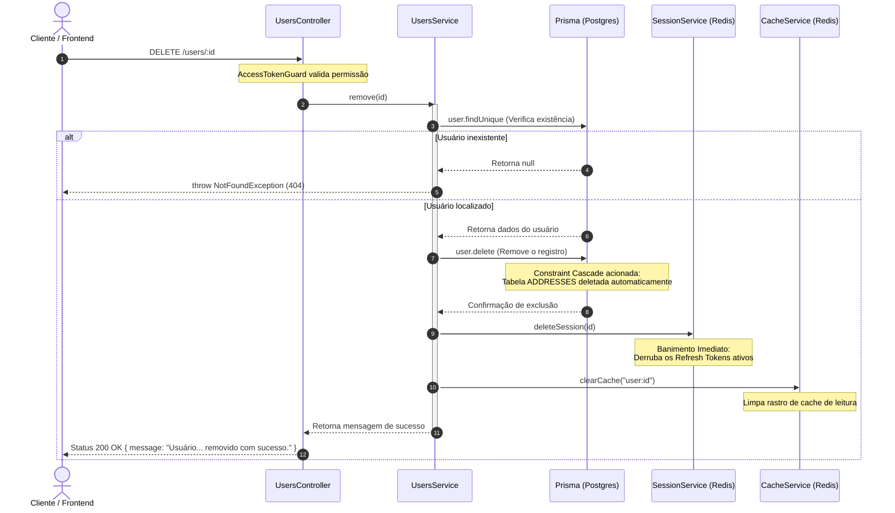
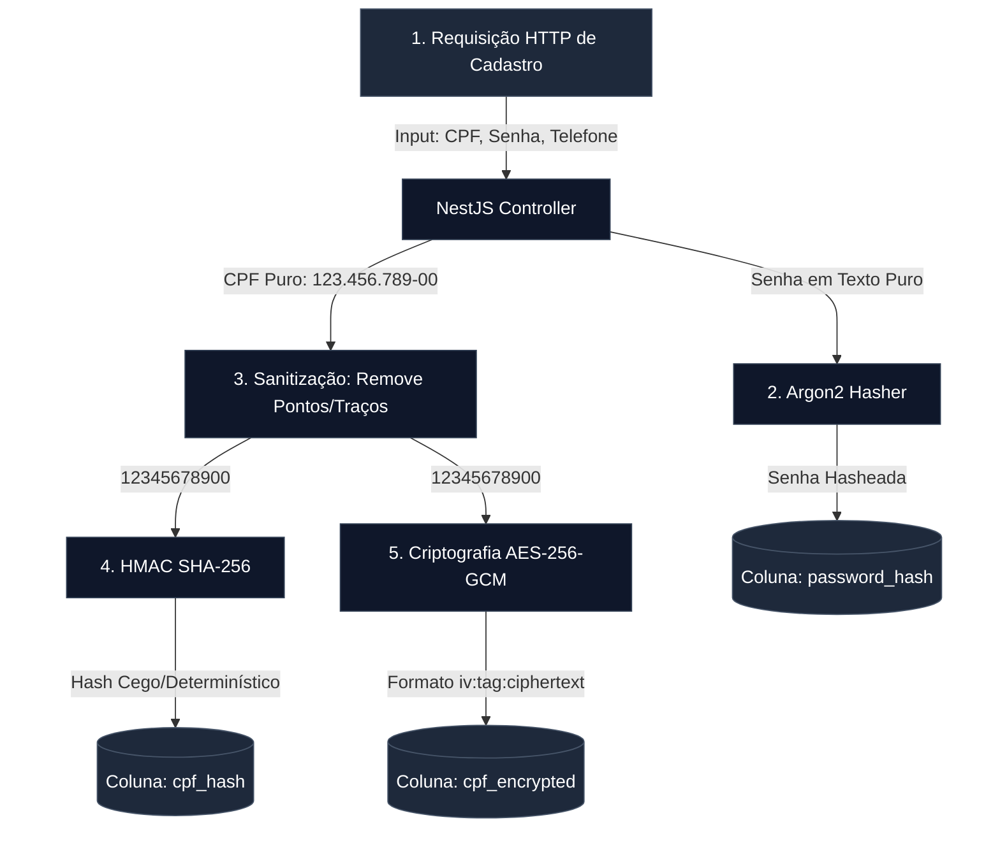
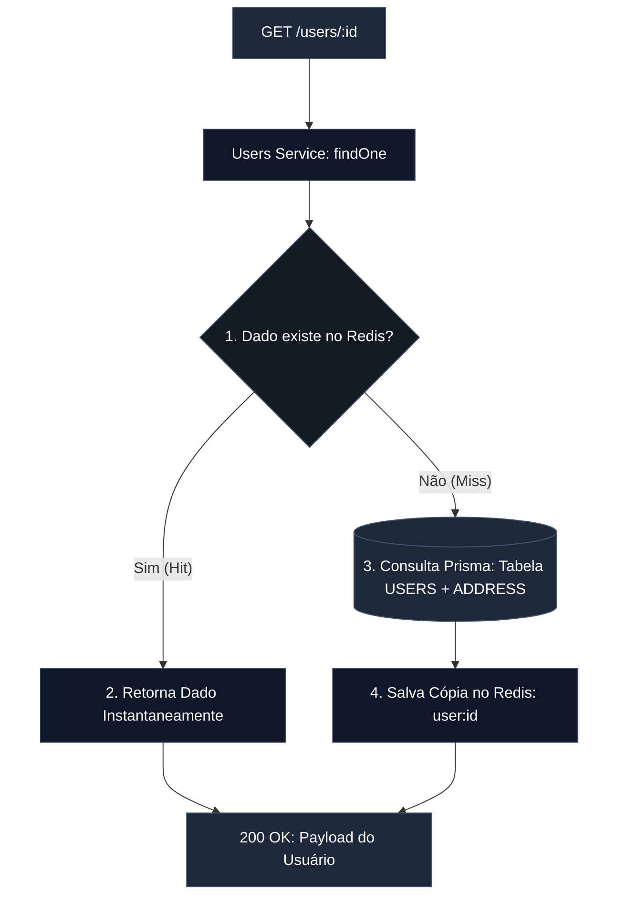

# Módulo de Usuários e Segurança de Dados

O módulo de gerenciamento de usuários (funcionários) foi desenhado seguindo rígidos padrões de segurança e privacidade de dados (alinhado a diretrizes como a LGPD), aplicando criptografia ponta a ponta e hashes determinísticos para indexação segura.

## Modelo de Relacionamento Local (Contexto ER)

A entidade `User` possui uma relação de dependência existencial `1:1` com a tabela `Address`. O endereço é tratado como uma sub-entidade aninhada (composição), sendo removido automaticamente via banco de dados caso o usuário seja deletado (`onDelete: Cascade`).

---

## Diagramas de Sequência do Módulo de Usuários

Para entender a ordem cronológica de execução e a interação entre as camadas do sistema (Controller, Service, Banco de Dados e Cache), os fluxos abaixo detalham os cenários de **Criação** e de **Leitura com Cache**.

### 1. Fluxo de Registro de Funcionário (`POST /users/register`)

Este fluxo demonstra o cadastro em cascata (usuário + endereço) e a geração de chaves criptográficas (Argon2 para senha e AES-GCM para CPF).

### 2. Fluxo de Consulta de Perfil (`GET /users/:id`)

Este fluxo detalha o comportamento do sistema lidando com a estratégia de Cache-Aside no Redis para otimização de leitura.

### 3. Fluxo de Atualização de Perfil (`PATCH /users/:id`)

Este diagrama demonstra como o sistema atualiza os dados cadastrais (permitindo ou não a alteração do endereço) e limpa a chave de cache do Redis para garantir a consistência das próximas leituras.

### 4. Fluxo de Exclusão Física e Deslogamento (`DELETE /users/:id`)

Este é o fluxo mais crítico de segurança. Ele ilustra o expurgo do usuário do banco, a queda do endereço em cascata e o comando coordenado para limpar o cache de leitura e banir a sessão ativa.

---

## Ciclo de Vida do Dado Sensível (CPF e Senha)

Abaixo está o fluxo detalhado de como a API intercepta, processa e protege as informações sensíveis desde a requisição de criação (`POST /users`) até o armazenamento no Banco de Dados.

## Engenharia de Segurança Aplicada

**1. Indexação Segura com Hash Determinístico (CPF)**

Para permitir que o sistema busque um usuário pelo CPF (evitando cadastros duplicados) sem que precisemos descriptografar toda a tabela ou salvar o CPF em texto limpo, aplicamos o conceito de Blind Index:

- O CPF é limpo e passado por uma função HMAC-SHA-256.
- O resultado é um hash idêntico para o mesmo CPF, permitindo buscas exatas (WHERE cpf_hash = :hash).

**2. Criptografia Autenticada (AES-256-GCM)**

O dado real do CPF é criptografado usando AES-256-GCM, que além da confidencialidade, garante a integridade do dado (garante que ele não foi alterado no banco).

- O valor é salvo no formato padronizado iv:authTag:cipher.

**3. Derivação de Chave com Argon2**

A senha do funcionário nunca toca o banco em texto puro. Utilizamos o algoritmo Argon2, vencedor da Password Hashing Competition, oferecendo a maior resistência atual contra ataques de força bruta e hardware dedicado (ASICs/GPUs).

**4. Transformação e Mascaramento na Saída (Leitura)**

Quando o sistema lista ou retorna os dados de um funcionário (GET /users/:id), a API descriptografa os dados necessários internamente, mas aplica máscaras de formatação antes de enviar a resposta ao cliente:

| Campo original | Tratamento na API (class-transformer / Utils) | Tratamento na API (class-transformer / Utils) |
| :------------- | :-------------------------------------------- | :-------------------------------------------- |
| CPF            | Descriptografa e ofusca os dígitos centrais.  | `123.***.***-00`                              |
| Telefone       | Aplica máscara regional padronizada.          | `(11) 91234-5678`                             |
| CEP            | Padroniza o formato de localização.           | `01001-000`                                   |

---

## Fluxo de Leitura Otimizada com Cache Service

Para evitar requisições desnecessárias ao banco de dados Postgres durante as checagens de perfil, o método `findOne` intercepta a busca utilizando uma estratégia de cache reativo no Redis.

---

## Ciclo de Vida e Consistência de Dados Mutáveis

Para impedir que a camada de cache retorne perfis desatualizados após alterações no sistema, o serviço de usuários implementa a invalidação de chaves por barramento de evento lógico nos métodos de escrita.

**1. Fluxo de Criação em Cascata (`POST /users/register`)**

O cadastro é público e aninha a criação do endereço na mesma query transacional do Prisma (`address: { create: { ... } }`). O CPF passa por limpeza de caracteres não numéricos (`\D`) via class-transformer antes de ser persistido.

**2. Fluxo de Atualização (`PATCH /users/:id`)**

- O usuário pode alterar dados cadastrais sem a obrigatoriedade de enviar propriedades de endereço.
- Assim que a mutação é confirmada no banco de dados, o comando `await this.cacheService.clearCache('user:id')` é disparado, eliminando o lixo de memória do Redis e forçando o próximo `GET` a ler o dado atualizado diretamente do banco.

**3. Fluxo de Exclusão Física (`DELETE /users/:id`)**

Ocorre o expurgo completo do registro. Para garantir a segurança interna do ecossistema, o sistema realiza uma limpeza em três etapas síncronas:

1. Deleta o registro no banco (o endereço cai junto por causa da constraint `Cascade`).
2. Dispara `this.sessionService.deleteSession(id)` para derrubar os Refresh Tokens ativos do Redis e deslogar o usuário de qualquer dispositivo.
3. Limpa o cache de leitura executando `this.cacheService.clearCache('user:id')`.

---

## Especificações Técnicas dos Endpoints

**1. Robustez na Validação de Entrada (CreateUserDto)**

- `@IsStrongPassword`: Aplica uma política estrita de segurança exigindo no mínimo 8 caracteres com obrigatoriedade de conter pelo menos 1 letra maiúscula, 1 minúscula, 1 número e 1 caractere especial.
- `@ValidateNested`: Aciona a validação profunda do NestJS para varrer as propriedades de endereço contidas dentro do `CreateAddressDto`, garantindo que formatos inválidos de CEP interrompam a requisição na borda da API.

**2. Ocultação Dinâmica na Camada de Saída**

A entidade `User` atua como um escudo de privacidade de dados. Os decorators `@Exclude()` garantem que chaves de segurança críticas nunca cheguem à camada de transporte de rede:

- `passwordHash` (Senha criptografada do usuário) -> Bloqueado
- `cpfHash` (Hash SHA-256 usado para buscas) -> Bloqueado
- `cpfEncrypted` (String AES-GCM bruta em repouso) -> Bloqueado

Na saída, o getter cpf captura a string encriptada, descriptografa-a em memória e aplica a máscara tradicional brasileira (000.000.000-00) dinamicamente através do class-transformer.
