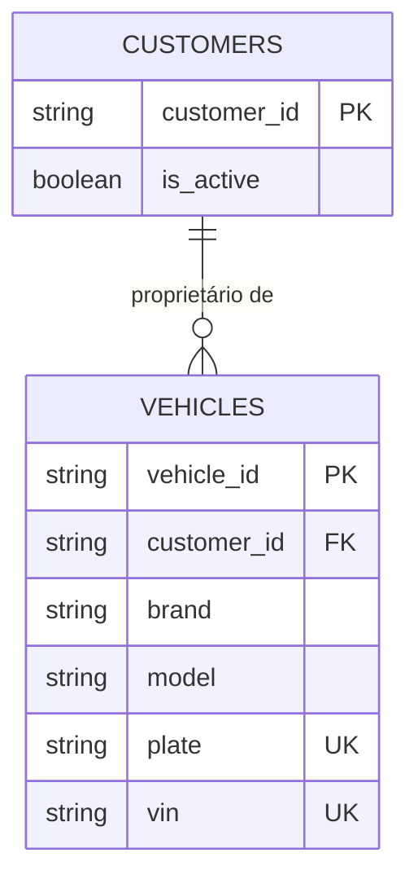
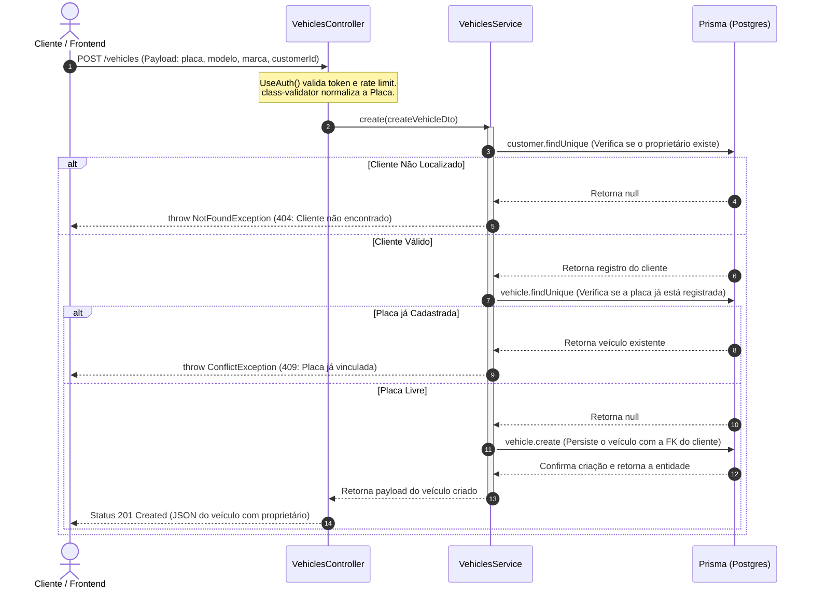
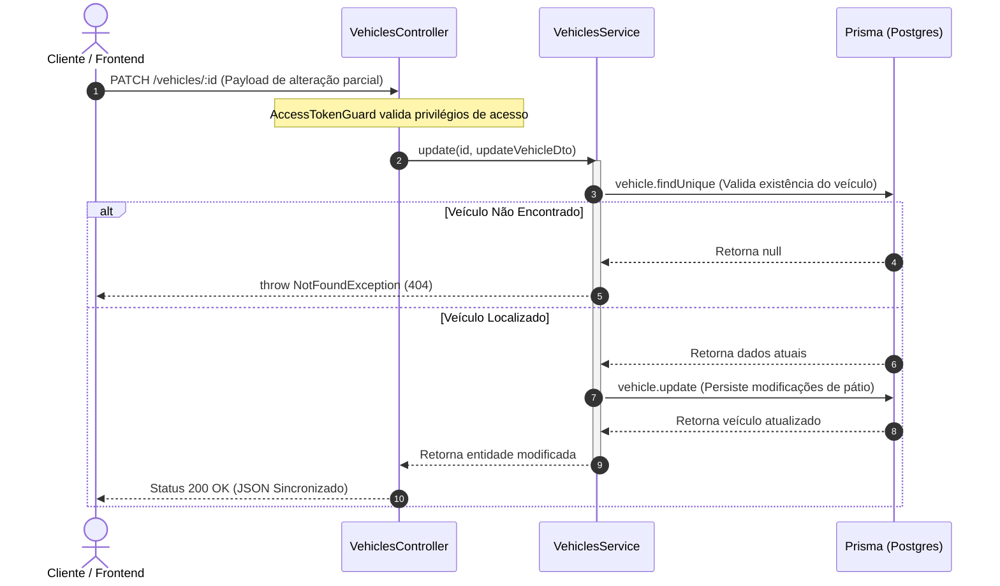
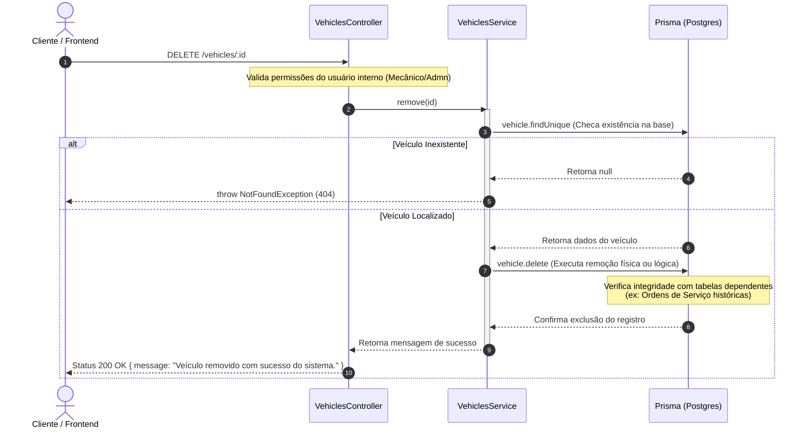
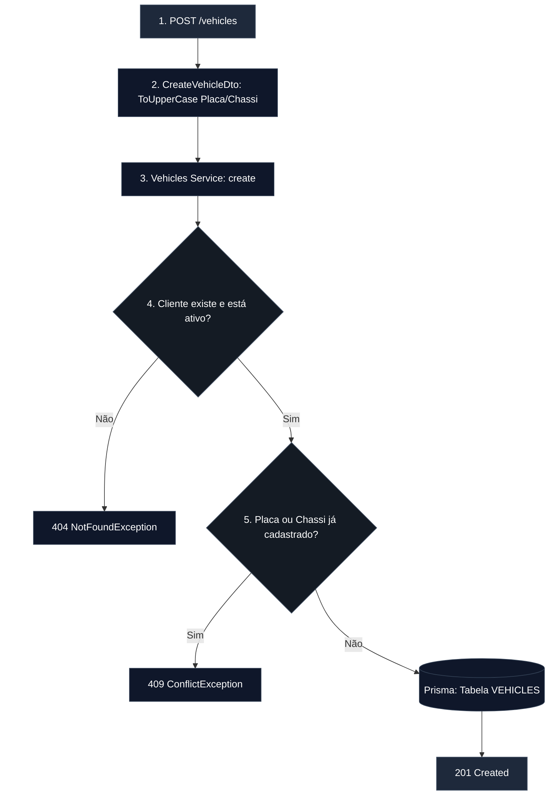

# Módulo de Veículos e Gestão de Frota

O módulo de veículos gerencia a frota de automóveis ou motocicletas atreladas aos clientes da oficina. Ele estabelece uma relação estrita de dependência com a entidade de Clientes e implementa regras de negócio automotivas rigorosas, como validação internacional de Chassis (VIN), formatação do padrão Mercosul e reciclagem de restrições exclusivas (`@unique`) em cenários de exclusão lógica.

## Modelo de Relacionamento Local (Contexto ER)

O ciclo de vida de um veículo depende obrigatoriamente da existência de um proprietário ativo no banco de dados, configurando uma relação de integridade referencial `1:N` com restrição de delegação em cascata desativada (`onDelete: Restrict`).

---

## Diagramas de Sequência do Módulo de Veículos

Para compreender o fluxo de mensagens entre o Controller, o Service e as tabelas do banco de dados, bem como as checagens de vínculo com proprietários, os diagramas abaixo detalham o ciclo de vida dos veículos.

### 1. Fluxo de Cadastro de Veículo (`POST /vehicles`)

Este diagrama ilustra o pipeline de validação de propriedade, checagem de duplicidade de placa no sistema e o vínculo relacional com a tabela de clientes.

### 2. Fluxo de Atualização Parcial de Metadados (`PATCH /vehicles/:id`)

Demonstra o comportamento do sistema ao atualizar informações dinâmicas do veículo (como quilometragem ou cor) sem permitir a alteração acidental de chaves de integridade como a placa.

### 3. Fluxo de Remoção e Desvinculação (`DELETE /vehicles/:id`)

Detallha o processo de expurgo ou arquivamento de um veículo do pátio operacional, garantindo a proteção contra quebras de restrição de chaves estrangeiras ativas.

---

## Regras de Negócio e Validação de Fluxo (Cadastro)

O processo de criação intercepta o payload, higieniza as entradas forçando letras maiúsculas em dados de identificação e valida a integridade do cliente antes de registrar o ativo.

---

## Solução Técnica para Habilitação de Re-cadastro (Unique Soft Delete Suffix)

Um dos maiores desafios de arquitetura ao adotar Soft Delete em colunas com restrições exclusivas (`@unique`) no banco de dados (como `plate` e `vin`) é que um item inativado impede que o mesmo dado seja cadastrado novamente no futuro.

Para solucionar isso sem perder o histórico do pátio, o método `remove()` executa uma mutação de liberação de chave concatenando um sufixo hexadecimal imutável gerado a partir do ID da própria entidade:

**Chave Original:** BRA2E19
**Chave Removida:** BRA2E19del-a8f4c2b1

Isso garante que a string original `BRA2E19` volte a ficar disponível imediatamente no banco de dados para novos cadastros de forma limpa, enquanto o registro antigo preserva a rastreabilidade histórica.

---

## Especificações Técnicas dos Endpoints

**1. Rigidez Normativa no DTO (class-validator):**

- **Padrão de Placas Nacional/Mercosul:** Validada através da expressão regular `/^[A-Z]{3}[0-9][A-Z0-9][0-9]{2}$/i`, aceitando de forma reativa os dois modelos vigentes de trânsito no Brasil.
- **Validação ISO 3779 (Chassi/VIN):** A regex `/^[A-HJ-NPR-Z0-9]{17}$/i` barra de forma nativa caracteres ilegais em registros de chassis no padrão internacional (letras **I**, **O** e **Q** são proibidas para evitar adulterações por similaridade visual com os numerais **1** e **0**).

## 2. Ciclo de Vida da Resposta (Serialization)

A propriedade `customerId` é escondida no payload de saída com o decorator `@Exclude()`. Em contrapartida, caso a consulta utilize relacionamentos `(include)`, a entidade aninha de forma automática o objeto completo mapeado de `Customer`, realizando o parse limpo na resposta do JSON.
